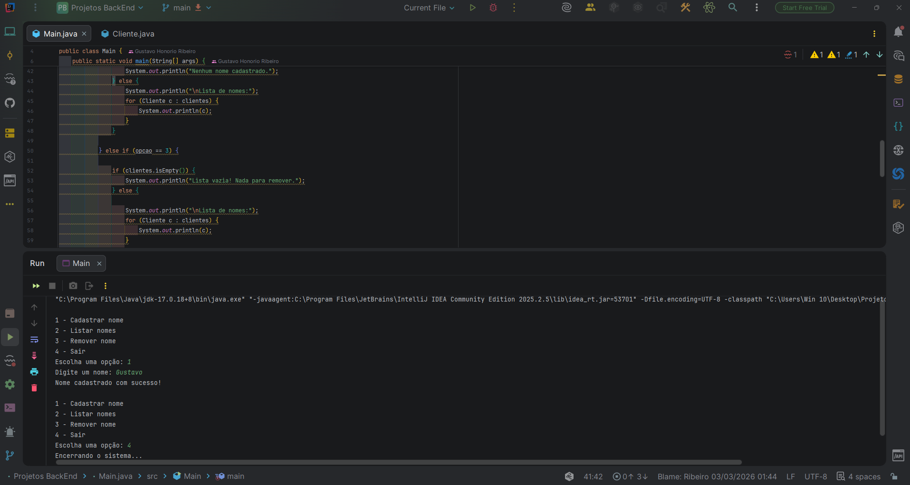

# 📋 Client Registration System (Java)

A simple console-based client management system built with Java, designed to practice core Object-Oriented Programming concepts and collection handling.

---

## 🖼 Screenshot



---

## 🚀 Features

* Register new clients with auto-incremented ID
* List all registered clients
* Remove a client by ID
* Input validation (empty name handling)
* Simple and clean console interface

---

## 🛠 Technologies Used

* Java 17 (LTS)
* ArrayList
* Object-Oriented Programming (OOP)
* IntelliJ IDEA

---

## 📂 Project Structure

```
client-registration-system/
├── assets/
│   └── images/
│       └── projeto-menu.png
├── src/
│   ├── Main.java
│   └── Cliente.java
├── README.md
└── .gitignore
```

---

## 📋 Requirements

* Java 17 or higher installed
* Git (optional)

---

## ▶️ How to Run the Project Locally

### 1️⃣ Clone the repository

```bash
git clone https://github.com/GustavoHRdev/Sistema-de-Gerenciamento-de-Clientes-Aplica-o-Console-.git
```

### 2️⃣ Navigate to the project folder

```bash
cd Sistema-de-Gerenciamento-de-Clientes-Aplica-o-Console-
```

### 3️⃣ Compile the project

```bash
javac src/*.java
```

### 4️⃣ Run the application

```bash
java -cp src Main
```

---

## 📌 How It Works

The system runs in a loop until the user selects the exit option.

### Menu Options

1 - Register name
2 - List names
3 - Remove name
4 - Exit

Each client receives an auto-generated ID when registered.

---

## 💻 Example Usage

```
1 - Register name
2 - List names
3 - Remove name
4 - Exit
Choose an option: 1
Enter a name: Gustavo
Name successfully registered!
```

---

## 🧠 Concepts Practiced

* Collections (ArrayList)
* Encapsulation
* Loops (`while`)
* Conditional logic (`if/else`)
* Object instantiation
* Scanner for user input
* Method overriding (`toString`)

---

## 📈 Possible Improvements

* Persist data to a file or database
* Implement search functionality
* Add update client feature
* Convert to Maven project
* Transform into a Spring Boot REST API

---

## 👨‍💻 Author

**Gustavo Ribeiro**
Backend Developer (Java Focused)
